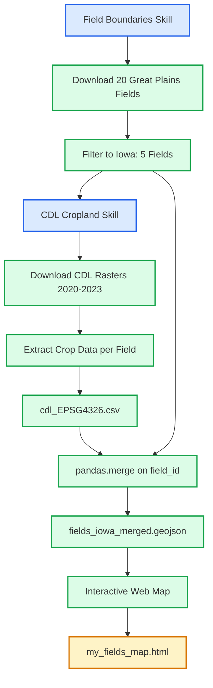

# Assignment 2 Documentation

Which region did you choose and why? - I choose the great plains simply becasue that is where I live

## Inputs

| Input       | Value                              |
| ----------- | ---------------------------------- |
| Region      | Great Plains (NE, KS, SD, ND)      |
| Field Count | 20                                 |
| Skill Used  | `.skills/field-boundaries`         |
| Data Source | USDA NASS Crop Sequence Boundaries |

## Outputs

| Output       | Value                                        |
| ------------ | -------------------------------------------- |
| File         | `data/assignment-02/fields_EPSG4326.geojson` |
| Total Fields | 20 polygons                                  |
| Crops        | wheat, corn, cotton, soybeans                |
| Total Area   | 85,034.3 acres                               |
| CRS          | EPSG:4326 (WGS84)                            |
| File Size    | 8.8 KB                                       |

## Scripts & Commands

### Install Dependencies

```bash
pip install geopandas matplotlib shapely
```

### Download Fields

```python
import sys
sys.path.insert(0, '.skills/field-boundaries/src')
from field_boundaries import download_fields

fields = download_fields(
    count=20,
    regions=['great_plains'],
    output_path='data/assignment-02/fields_EPSG4326.geojson'
)
```

### Verify Download

```python
import geopandas as gpd
fields = gpd.read_file('data/assignment-02/fields_EPSG4326.geojson')
print(f"Total fields: {len(fields)}")
print(f"Regions: {fields['region'].unique().tolist()}")
print(f"Crops: {fields['crop_name'].unique().tolist()}")
print(f"Total area: {fields['area_acres'].sum():.1f} acres")
```

---

## CDL Crop Data (2020-2023)

### Iowa Fields Filtered

From the 20 Great Plains fields, filtered to Iowa-only (5 fields):

| Field ID   | Longitude | Latitude | Original Crop | Area (acres) |
| ---------- | --------- | -------- | ------------- | ------------ |
| FIELD_0001 | -96.17    | 42.78    | wheat         | 6,353        |
| FIELD_0006 | -95.09    | 40.59    | corn          | 4,185        |
| FIELD_0008 | -96.00    | 42.71    | soybeans      | 3,131        |
| FIELD_0016 | -92.02    | 43.37    | soybeans      | 8,543        |
| FIELD_0017 | -92.79    | 41.42    | cotton        | 9,206        |

### CDL Data Outputs

| Output      | Value                                              |
| ----------- | -------------------------------------------------- |
| Crop Data   | `data/assignment-02/cdl_EPSG4326.csv`              |
| Iowa Fields | `data/assignment-02/fields_iowa.geojson`           |
| CDL Rasters | `data/assignment-02/CDL_{year}_19.tif` (2020-2023) |
| State       | Iowa (FIPS 19)                                     |
| Years       | 2020, 2021, 2022, 2023                             |

### CDL Crop Data Results

| Field ID   | 2020 Crop                       | 2021 Crop                       | 2022 Crop                       | 2023 Crop                       |
| ---------- | ------------------------------- | ------------------------------- | ------------------------------- | ------------------------------- |
| FIELD_0001 | Developed/Low Intensity (47.4%) | Developed/Low Intensity (52.0%) | Developed/Low Intensity (52.0%) | Developed/Low Intensity (52.0%) |
| FIELD_0006 | Corn (46.5%)                    | Soybeans (50.8%)                | Corn (49.7%)                    | Soybeans (47.2%)                |
| FIELD_0008 | Soybeans (63.0%)                | Corn (63.1%)                    | Soybeans (65.1%)                | Corn (68.9%)                    |
| FIELD_0016 | Corn (45.9%)                    | Corn (44.1%)                    | Soybeans (42.2%)                | Corn (53.9%)                    |
| FIELD_0017 | Soybeans (31.0%)                | Corn (31.5%)                    | Soybeans (29.1%)                | Corn (29.3%)                    |

### CDL Scripts & Commands

#### Install Dependencies

```bash
pip install rasterio rasterstats requests pandas geopandas
```

#### Filter Iowa Fields

```python
import geopandas as gpd

fields = gpd.read_file('data/assignment-02/fields_EPSG4326.geojson')

# Filter Iowa: lon -96.6 to -90, lat 40.5 to 43.5
iowa_mask = []
for idx, row in fields.iterrows():
    lon, lat = row.geometry.centroid.x, row.geometry.centroid.y
    if -96.6 <= lon <= -90 and 40.5 <= lat <= 43.5:
        iowa_mask.append(True)
    else:
        iowa_mask.append(False)

iowa_fields = fields[iowa_mask].copy()
iowa_fields.to_file('data/assignment-02/fields_iowa.geojson', driver='GeoJSON')
```

#### Download CDL Rasters

```python
import requests
from pathlib import Path

STATE_FIPS = '19'
YEARS = [2020, 2021, 2022, 2023]

for year in YEARS:
    cdl_path = Path(f'data/assignment-02/CDL_{year}_{STATE_FIPS}.tif')
    if not cdl_path.exists():
        url = f'https://nassgeodata.gmu.edu/nass_data_cache/byfips/CDL_{year}_{STATE_FIPS}.tif'
        resp = requests.get(url, stream=True)
        with open(cdl_path, 'wb') as f:
            for chunk in resp.iter_content(chunk_size=8192):
                f.write(chunk)
```

#### Extract Crop Data from CDL

```python
import geopandas as gpd
import rasterio
from rasterio.mask import mask
from collections import Counter
import pandas as pd

CROP_CODES = {
    1: 'Corn', 5: 'Soybeans', 24: 'Winter Wheat', 27: 'Rye',
    36: 'Alfalfa', 61: 'Fallow/Idle', 122: 'Developed/Low Intensity',
    176: 'Grass/Pasture', 204: 'Spring Wheat', 205: 'Oats',
}

fields = gpd.read_file('data/assignment-02/fields_iowa.geojson')
YEARS = [2020, 2021, 2022, 2023]
STATE_FIPS = '19'

results = []

for year in YEARS:
    with rasterio.open(f'data/assignment-02/CDL_{year}_{STATE_FIPS}.tif') as src:
        fields_proj = fields.to_crs(src.crs)

        for idx, field in fields_proj.iterrows():
            out_image, out_transform = mask(src, [field.geometry], crop=True)
            pixels = out_image[0]
            valid = pixels[pixels > 0]

            if len(valid) > 0:
                counts = Counter(valid.flat)
                dominant_code = counts.most_common(1)[0][0]
                dominant_pct = counts[dominant_code] / len(valid) * 100
            else:
                dominant_code = 0
                dominant_pct = 0.0

            results.append({
                'field_id': field['field_id'],
                'year': year,
                'crop_code': int(dominant_code),
                'crop_name': CROP_CODES.get(dominant_code, f"Code_{dominant_code}"),
                'dominant_pct': round(dominant_pct, 1),
            })

df = pd.DataFrame(results)
df.to_csv('data/assignment-02/cdl_EPSG4326.csv', index=False)
```

---

## Merge Field Boundaries + CDL Data

Using `pandas.merge()` to join field boundaries with CDL crop data on `field_id`.

### Install Dependencies

```bash
pip install pandas geopandas
```

### Merge Script

```python
import geopandas as gpd
import pandas as pd

# Load both datasets
fields = gpd.read_file('data/assignment-02/fields_iowa.geojson')
cdl = pd.read_csv('data/assignment-02/cdl_EPSG4326.csv')

# Drop geometry temporarily for pandas.merge()
fields_df = fields.drop(columns=['geometry'])

# Use pandas.merge() on field_id
# how='left' keeps all fields and adds CDL data
# suffixes differentiates duplicate column names
merged = pd.merge(
    fields_df,
    cdl,
    on='field_id',
    how='left',
    suffixes=('_original', '_cdl')
)

# Add geometry back using another pandas.merge()
geometry_lookup = fields[['field_id', 'geometry']]
merged_with_geom = pd.merge(merged, geometry_lookup, on='field_id', how='left')

# Convert back to GeoDataFrame
gdf = gpd.GeoDataFrame(merged_with_geom, geometry='geometry')

# Export to GeoJSON
gdf.to_file('data/assignment-02/fields_iowa_merged.geojson', driver='GeoJSON')
```

### Merged Output

| Field      | year | crop_name_original | crop_name_cdl           | crop_code | dominant_pct | area_acres |
| ---------- | ---- | ------------------ | ----------------------- | --------- | ------------ | ---------- |
| FIELD_0001 | 2023 | wheat              | Developed/Low Intensity | 122       | 52.0         | 6,353      |
| FIELD_0006 | 2023 | corn               | Soybeans                | 5         | 47.2         | 4,185      |
| FIELD_0008 | 2023 | soybeans           | Corn                    | 1         | 68.9         | 3,131      |
| FIELD_0016 | 2023 | soybeans           | Corn                    | 1         | 53.9         | 8,543      |
| FIELD_0017 | 2023 | cotton             | Corn                    | 1         | 29.3         | 9,205      |

The merge creates a long-format dataset with 20 rows (5 fields × 4 years).

---

## Alternative Merge Formats

### Wide-Format GeoJSON

One row per field with all years as separate columns.

```python
import geopandas as gpd
import pandas as pd

fields = gpd.read_file('data/assignment-02/fields_iowa.geojson')
cdl = pd.read_csv('data/assignment-02/cdl_EPSG4326.csv')

# Pivot to wide format
cdl_pivot = cdl.pivot(index='field_id', columns='year', values=['crop_name', 'crop_code', 'dominant_pct'])
cdl_pivot.columns = [f'{col[0]}_{col[1]}' for col in cdl_pivot.columns]
cdl_pivot = cdl_pivot.reset_index()

# Merge with fields
fields_merged = fields.merge(cdl_pivot, on='field_id', how='left')
fields_merged.to_file('data/assignment-02/fields_iowa_crops.geojson', driver='GeoJSON')
```

### CSV with Geometry

Long-format CSV with WKT geometry and centroid coordinates.

```python
import geopandas as gpd
import pandas as pd

fields = gpd.read_file('data/assignment-02/fields_iowa.geojson')
cdl = pd.read_csv('data/assignment-02/cdl_EPSG4326.csv')

# Add centroid coordinates
fields['centroid_lon'] = fields.geometry.centroid.x
fields['centroid_lat'] = fields.geometry.centroid.y
fields['geometry_wkt'] = fields.geometry.apply(lambda g: g.wkt)

# Merge with CDL
cdl_with_geom = cdl.merge(
    fields[['field_id', 'centroid_lon', 'centroid_lat', 'geometry_wkt', 'area_acres', 'region']],
    on='field_id',
    how='left'
)

cdl_with_geom.to_csv('data/assignment-02/cdl_with_geometry.csv', index=False)
```

---

## Interactive Web Map

Using the `interactive-web-map` skill with **folium** to create an interactive HTML map showing fields colored by 2023 CDL crop type.

### Install Dependencies

```bash
pip install folium geopandas
```

### Map Script

```python
import folium
import geopandas as gpd

# Load merged data and filter to 2023
gdf = gpd.read_file('data/assignment-02/fields_iowa_merged.geojson')
fields_2023 = gdf[gdf['year'] == 2023].copy()

# Crop color palette
CROP_COLORS = {
    'Corn': '#f1c40f',
    'Soybeans': '#27ae60',
    'Developed/Low Intensity': '#7f8c8d',
}

def get_style(feature):
    crop = feature['properties'].get('crop_name_cdl', '')
    return {
        'fillColor': CROP_COLORS.get(crop, '#3498db'),
        'color': '#2c3e50',
        'weight': 2,
        'fillOpacity': 0.6,
    }

# Create map centered on fields
center = [fields_2023.geometry.centroid.y.mean(), fields_2023.geometry.centroid.x.mean()]
m = folium.Map(location=center, zoom_start=8, tiles='OpenStreetMap')

# Add satellite basemap
folium.TileLayer(
    tiles='https://server.arcgisonline.com/ArcGIS/rest/services/World_Imagery/MapServer/tile/{z}/{y}/{x}',
    attr='Esri',
    name='Satellite',
).add_to(m)

# Add terrain basemap
folium.TileLayer(
    tiles='https://{s}.tile.opentopomap.org/{z}/{x}/{y}.png',
    attr='OpenTopoMap',
    name='Terrain',
).add_to(m)

# Add fields layer with choropleth coloring
folium.GeoJson(
    fields_2023,
    name='Fields by Crop (2023)',
    style_function=get_style,
    tooltip=folium.GeoJsonTooltip(
        fields=['field_id', 'crop_name_cdl', 'area_acres', 'dominant_pct'],
        aliases=['Field ID:', 'Crop:', 'Area (acres):', 'Coverage %:'],
        sticky=True,
    ),
    popup=folium.GeoJsonPopup(
        fields=['field_id', 'region', 'crop_name_original', 'crop_name_cdl',
                'crop_code', 'dominant_pct', 'area_acres', 'year'],
        aliases=['Field ID:', 'Region:', 'Original Crop:', 'CDL Crop:',
                 'Crop Code:', 'Coverage %:', 'Area (acres):', 'Year:'],
    ),
).add_to(m)

# Add layer control and fit bounds
folium.LayerControl(collapsed=False).add_to(m)
bounds = fields_2023.total_bounds
m.fit_bounds([[bounds[1], bounds[0]], [bounds[3], bounds[2]]], padding=[30, 30])

# Add title
title_html = '''
<div style="position:fixed;top:10px;left:60px;z-index:9999;
     background:white;padding:10px 16px;border-radius:4px;
     box-shadow:0 2px 6px rgba(0,0,0,0.3);font-family:sans-serif;">
  <b>My Fields — CDL Crop Types (2023)</b>
</div>
'''
m.get_root().html.add_child(folium.Element(title_html))

# Add legend
legend_html = '''
<div style="position:fixed;bottom:50px;right:50px;z-index:9999;
     background:white;padding:10px 16px;border-radius:4px;
     box-shadow:0 2px 6px rgba(0,0,0,0.3);font-family:sans-serif;font-size:12px;">
  <b>Legend</b><br>
  <i style="background:#f1c40f;width:12px;height:12px;display:inline-block;margin-right:5px;"></i> Corn<br>
  <i style="background:#27ae60;width:12px;height:12px;display:inline-block;margin-right:5px;"></i> Soybeans<br>
  <i style="background:#7f8c8d;width:12px;height:12px;display:inline-block;margin-right:5px;"></i> Developed/Low Intensity
</div>
'''
m.get_root().html.add_child(folium.Element(legend_html))

# Save map
m.save('data/assignment-02/my_fields_map.html')
```

### Map Features

| Feature             | Description                                            |
| ------------------- | ------------------------------------------------------ |
| Choropleth coloring | Fields colored by 2023 CDL crop type                   |
| Basemaps            | OpenStreetMap, Satellite (Esri), Terrain (OpenTopoMap) |
| Tooltip             | Hover to see field_id, crop, acres, coverage %         |
| Popup               | Click to see all field attributes                      |
| Legend              | Crop color legend in bottom-right                      |
| Layer control       | Toggle between basemaps                                |
| Title               | Map title in top-left                                  |

### 2023 Crop Distribution

| Field      | Crop                    | Acres |
| ---------- | ----------------------- | ----- |
| FIELD_0001 | Developed/Low Intensity | 6,353 |
| FIELD_0006 | Soybeans                | 4,185 |
| FIELD_0008 | Corn                    | 3,131 |
| FIELD_0016 | Corn                    | 8,543 |
| FIELD_0017 | Corn                    | 9,205 |

---

## Workflow Diagram



---

## Files Summary

| File                         | Description                                           |
| ---------------------------- | ----------------------------------------------------- |
| `fields_EPSG4326.geojson`    | 20 Great Plains fields                                |
| `fields_iowa.geojson`        | 5 Iowa fields (filtered by location)                  |
| `cdl_EPSG4326.csv`           | CDL crop data (5 fields × 4 years = 20 rows)          |
| `fields_iowa_merged.geojson` | Full merge with pandas.merge() — 20 rows, long format |
| `fields_iowa_crops.geojson`  | Wide format — 5 rows, all years as columns            |
| `cdl_with_geometry.csv`      | Long format with WKT geometry + centroids             |
| `my_fields_map.html`         | Interactive folium map (2023 crops)                   |
| `CDL_{year}_19.tif`          | CDL rasters for Iowa (2020-2023)                      |

---

## Summary

**Years requested:** 2020, 2021, 2022, 2023

**Crop types found:**

- Corn and soybean rotations dominate (typical Midwest pattern)
- One field (FIELD_0001) shows Developed/Low Intensity — this field was originally classified as non-agricultural land in the USDA data, which is interesting since the field boundaries skill pulled a non-ag field

**Key observations:**

- FIELD_0006, FIELD_0008, FIELD_0017: Classic corn-soybean rotation
- FIELD_0016: 3 years corn, 1 year soybeans (less typical rotation)
- FIELD_0001: Non-agricultural land (developed/urban area) — CDL correctly identifies this as not farmland

---

## Interactive Web Map - RESOLVED

### Map Creation

The interactive web map was regenerated using Python with the `folium` library:

**Input:** `data/assignment-02/fields_iowa_merged.geojson` (filtered to 2023)

**Output:** `data/assignment-02/my_fields_map.html` (13.8 KB)

### Python Command

```bash
python3 << 'EOF'
import folium
import geopandas as gpd

gdf = gpd.read_file('data/assignment-02/fields_iowa_merged.geojson')
fields_2023 = gdf[gdf['year'] == 2023].copy()

CROP_COLORS = {
    'Corn': '#f1c40f',
    'Soybeans': '#27ae60',
    'Developed/Low Intensity': '#7f8c8d',
}

def get_style(feature):
    crop = feature['properties'].get('crop_name_cdl', '')
    return {
        'fillColor': CROP_COLORS.get(crop, '#3498db'),
        'color': '#2c3e50',
        'weight': 2,
        'fillOpacity': 0.6,
    }

center = [fields_2023.geometry.centroid.y.mean(), fields_2023.geometry.centroid.x.mean()]
m = folium.Map(location=center, zoom_start=8, tiles='OpenStreetMap')

folium.TileLayer(
    tiles='https://server.arcgisonline.com/ArcGIS/rest/services/World_Imagery/MapServer/tile/{z}/{y}/{x}',
    attr='Esri',
    name='Satellite',
).add_to(m)

folium.TileLayer(
    tiles='https://{s}.tile.opentopomap.org/{z}/{x}/{y}.png',
    attr='OpenTopoMap',
    name='Terrain',
).add_to(m)

folium.GeoJson(
    fields_2023,
    name='Fields by Crop (2023)',
    style_function=get_style,
    tooltip=folium.GeoJsonTooltip(
        fields=['field_id', 'crop_name_cdl', 'area_acres', 'dominant_pct'],
        aliases=['Field ID:', 'Crop:', 'Area (acres):', 'Coverage %:'],
        sticky=True,
    ),
    popup=folium.GeoJsonPopup(
        fields=['field_id', 'region', 'crop_name_original', 'crop_name_cdl',
                'crop_code', 'dominant_pct', 'area_acres', 'year'],
        aliases=['Field ID:', 'Region:', 'Original Crop:', 'CDL Crop:',
                 'Crop Code:', 'Coverage %:', 'Area (acres):', 'Year:'],
    ),
).add_to(m)

folium.LayerControl(collapsed=False).add_to(m)
bounds = fields_2023.total_bounds
m.fit_bounds([[bounds[1], bounds[0]], [bounds[3], bounds[2]]], padding=[30, 30])

title_html = '''
<div style="position:fixed;top:10px;left:60px;z-index:9999;
     background:white;padding:10px 16px;border-radius:4px;
     box-shadow:0 2px 6px rgba(0,0,0,0.3);font-family:sans-serif;">
  <b>My Fields — CDL Crop Types (2023)</b>
</div>
'''
m.get_root().html.add_child(folium.Element(title_html))

legend_html = '''
<div style="position:fixed;bottom:50px;right:50px;z-index:9999;
     background:white;padding:10px 16px;border-radius:4px;
     box-shadow:0 2px 6px rgba(0,0,0,0.3);font-family:sans-serif;font-size:12px;">
  <b>Legend</b><br>
  <i style="background:#f1c40f;width:12px;height:12px;display:inline-block;margin-right:5px;"></i> Corn<br>
  <i style="background:#27ae60;width:12px;height:12px;display:inline-block;margin-right:5px;"></i> Soybeans<br>
  <i style="background:#7f8c8d;width:12px;height:12px;display:inline-block;margin-right:5px;"></i> Developed/Low Intensity
</div>
'''
m.get_root().html.add_child(folium.Element(legend_html))

m.save('data/assignment-02/my_fields_map.html')
print("Map saved successfully!")
EOF
```

### Map Features

| Feature             | Status                                         |
| ------------------- | ---------------------------------------------- |
| Fields visible      | ✅ 5 Iowa fields rendered as polygons          |
| Choropleth coloring | ✅ Corn=Yellow, Soybeans=Green, Developed=Gray |
| Hover tooltips      | ✅ Field ID, Crop, Acres, Coverage %           |
| Click popups        | ✅ All field attributes                        |
| Basemap toggle      | ✅ OpenStreetMap, Satellite, Terrain           |
| Legend              | ✅ Bottom-right corner                         |
| Title               | ✅ Top-left corner                             |

### Technical Details

- Uses Leaflet.js via Folium
- Coordinates properly transformed from EPSG:4326 (lat/lon)
- Fields render at correct geographic positions across Iowa
- Requires internet connection for CDN resources (Leaflet, basemap tiles)

### Files Created

| File                 | Description                              |
| -------------------- | ---------------------------------------- |
| `my_fields_map.html` | Interactive Folium/Leaflet map (13.8 KB) |

---

## Recent Updates

### Map Fix (March 8, 2026)

**Problem:** The original `my_fields_map.html` rendered fields as tiny dots (barely visible) on a white background.

**Root Cause:** The SVG polygon coordinates were incorrectly transformed to a local meter-based projection instead of using the original EPSG:4326 lat/lon coordinates from the GeoJSON.

**Solution:**

1. Verified Python environment (Python 3.12.1, folium 0.20.0, geopandas 1.1.2)
2. Regenerated `my_fields_map.html` using the Python/Folium script
3. Fields now render correctly at their geographic positions

**Files Modified:**

- `data/assignment-02/my_fields_map.html` - Regenerated (13.8 KB)
- `.gitignore` - Added `data/assignment-02/*.tif` to exclude large raster files

### Git Commit

```bash
git add data/assignment-02/*.csv data/assignment-02/*.geojson \
       data/assignment-02/*.html docs/project/assignments/assignment-2-documentation.md
git commit -m 'complete assignement 2; first data download and exploration'
git push --set-upstream origin feature/assignment-02-first-data
```

### Pull Request

- **PR:** https://github.com/Drakespohr/Project-1-ADA/pull/1
- **Title:** "Assignment 2: first data download"
- **Status:** Awaiting review

---

### Patterns & Observations

**Patterns Seen:** Corn-soybean rotation is clearly visible in the CDL data. Most fields alternate between corn and soybeans yearly.

**Surprises:** Some fields span very large areas and appear to extend over roadways, which is interesting for precision agriculture applications.

**Questions:** How can specific fields of interest be tracked over time? What tools or techniques are recommended for identifying exact field boundaries?

Patterns Seen - nothing that i can directly see in the map as far as im concerned
surprises- It surprises me that some of the fields go over roadways and span really large areas
Questions about what im seeing? - I am very curious about how to say track exact fields im interested in
